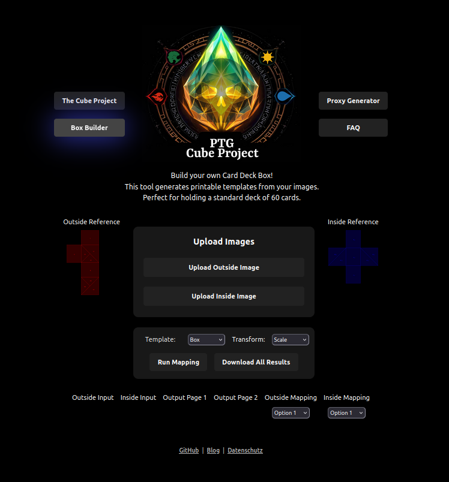

# Origami Mapper

**Assembly video:**
[YouTube: Box Assembly](https://www.youtube.com/watch?v=E-NGbi4VIIs)

A web application to create custom, printable templates for origami boxes. Upload your own images to generate a unique design for a foldable box, perfect for holding a standard 60-card deck.




This project transforms the original Python-based command-line tool into a user-friendly web interface using React and TypeScript.

## Features

- **Custom Box Designs:** Use your own images for the outside and inside of the box.
- **Image Transformations:** Apply different tiling and scaling effects to your images to get the perfect look:
  - **Scale:** Stretches or shrinks the image to the A4 aspect ratio.
  - **Tile (Fill A4):** Repeats the image to fill the entire A4 page.
  - **Tile 4x (2x2):** Creates a 2x2 grid of your image.
  - **Tile 8x (4x2):** Creates a 4x2 grid, intelligently shrinking or cropping the image to fit.
- **Live Preview:** See how your images will look on the final box before printing.
- **Easy Download:** Get all your printable pages and instruction guides in a single `.zip` file.

## How to Use

1.  **Visit the Website:** www.shopping-now.net/origami-mapper
2.  **Upload Images:** Select and upload an "Outside Image" and an "Inside Image".
3.  **Choose Transform:** Select an image transformation mode from the dropdown. The image previews will update automatically.
4.  **Run Mapping:** Click the "Run Mapping" button to generate the final print-out templates.
5.  **Download:** Click "Download All Results" to save a `.zip` file containing:
    - `output_page1.png` & `output_page2.png`: The A4 pages to print.
    - `Instruction/` folder: Images showing how your original pictures are mapped onto the box template.

## For Developers

To run this project locally:

1.  **Clone the repository:**
    ```sh
    git clone https://github.com/danielroth1/OrigamiMapper.git
    cd OrigamiMapper/webpage
    ```

2.  **Install dependencies:**
    ```sh
    npm install
    ```

3.  **Run the development server:**
    ```sh
    npm run dev
    ```
    The application will be available at `http://localhost:5173` (or another port if 5173 is busy).

4.  **Build for production:**
    ```sh
    npm run build
    ```
    This will create a `dist` folder with the optimized production build.


## Legacy Python CLI Usage

This website allows you to create a printout for origami boxes with your own custom images.

**Assembly video:**
[YouTube: Box Assembly](https://www.youtube.com/watch?v=E-NGbi4VIIs)

The base is an A4 paper so the custom image can be printed on with any office printer.
You will need two images, one for the inside of the box and one for the outside. You can also use the same image for both.

### Getting Started (Python CLI)

Create an image that shows you where each part of your image is drawn on the box.
Afterwards, open `examples/box_page1_template_interm.jpg` and `examples/box_page2_template_interm.jpg`:

```sh
/usr/local/bin/python3 /Users/daniel/Projects/OrigamiMapper/origami_mapper.py \
  -outside auxiliary/empty.jpg \
  -inside auxiliary/empty.jpg \
  -output_page1 examples/box_page1_template.jpg \
  -output_page2 examples/box_page2_template.jpg \
  -output_inside_mapping examples/box_inside_mapping.jpg \
  -output_outside_mapping examples/box_outside_mapping.jpg \
  -template templates/box.json
```

### Example: Two Images in `examples/mana_box/`

```sh
mkdir -p examples/mana_box/output
/usr/local/bin/python3 /Users/daniel/Projects/OrigamiMapper/origami_mapper.py \
  -outside examples/mana_box/page1.jpg \
  -inside examples/mana_box/page2.jpg \
  -output_page1 examples/mana_box/output/page1_output.jpg \
  -output_page2 examples/mana_box/output/page2_output.jpg \
  -output_outside_mapping examples/mana_box/output/output_outside_mapping.jpg \
  -output_inside_mapping examples/mana_box/output/output_inside_mapping.jpg \
  -template templates/box.json
```

`examples/mana_box/output/output_inside_mapping.jpg` and `examples/mana_box/output/output_outside_mapping.jpg` show the mapping on the original image to get an idea how the box will look like.

`examples/mana_box/output/page1_output.jpg` and `examples/mana_box/output/page2_output.jpg` are the A4 images for the printer.

